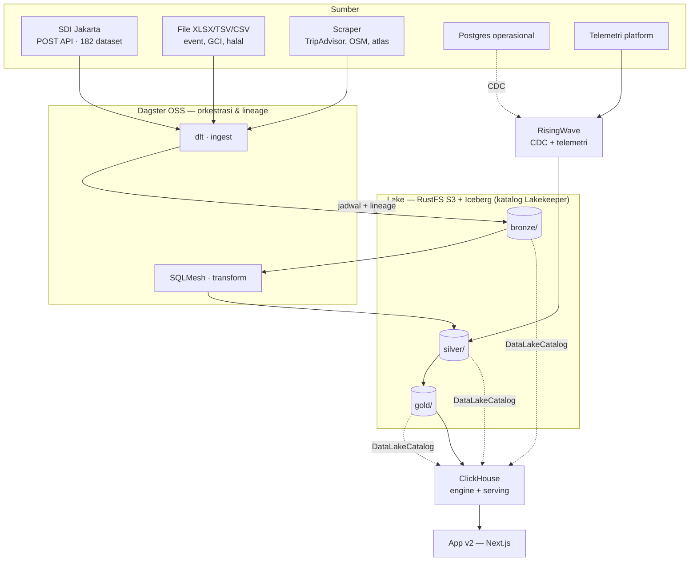

# Desain Lakehouse Platform Data Dispar

**Tanggal:** 12 Agustus 2026
**Status:** disetujui untuk masuk tahap perencanaan implementasi
**Menutup:** item **K3** MoM Disparekraf 13 Juli 2026 — *"Arsitektur Lake House 3 lapis (Bronze/Silver/Gold) berbasis DuckDB atau ClickHouse, fleksibel siap ke Oracle"*

---

## 1. Latar & pendorong

Platform Data Dispar saat ini berjalan self-hosted di server Depok (Portainer, `dispar.rantai.dev`) dengan **satu Postgres tunggal**. Semua data analitik disimpan sebagai JSONB generik (`record.data`), dengan tabel `report` sebagai snapshot siap-saji. Secara konsep ini sudah menyerupai Bronze + Gold, tetapi tanpa lapisan yang eksplisit, tanpa tipe kolom, tanpa lineage, dan tanpa dimensi bersama.

Pendorong utama proyek ini **bukan performa**. Volume data sekarang ±140.000 baris — Postgres sanggup menangani seratus kali lipatnya. Pendorongnya adalah:

1. **Deliverable arsitektur resmi.** Dinas perlu melihat arsitektur Lake House yang benar-benar ada, berjalan, dan bisa diaudit — bukan diagram di slide.
2. **Komersialisasi.** Stack ini akan dijual RantAI dalam dua bentuk: **produk SaaS multi-tenant** dan **produk software on-prem berlisensi**. Ini membatasi pilihan tool secara ketat (lihat §2).
3. **Portabilitas ke Oracle.** MoM meminta arsitektur yang "fleksibel siap ke Oracle" — data tidak boleh terkunci di dalam satu engine.

## 2. Batasan lisensi (menentukan pilihan tool)

Karena model bisnisnya SaaS multi-tenant **dan** penjualan produk on-prem, seluruh stack harus **Apache 2.0 atau MIT**. Lisensi non-open-source (ELv2, BSL, AGPL) menutup salah satu atau kedua model bisnis tersebut.

Hasil verifikasi per Agustus 2026:

| Tool | Lisensi | Putusan |
|---|---|---|
| ClickHouse | Apache 2.0 | ✅ dipakai |
| Apache Iceberg | Apache 2.0 | ✅ dipakai |
| Lakekeeper (katalog Iceberg REST) | Apache 2.0 | ✅ dipakai |
| RustFS | Apache 2.0 | ✅ dipakai |
| dlt (dlthub) | Apache 2.0 | ✅ dipakai |
| Dagster OSS | Apache 2.0 | ✅ dipakai |
| SQLMesh | Apache 2.0 | ✅ dipakai |
| RisingWave | Apache 2.0 | ✅ dipakai (opsional) |
| dbt Core v2 | Apache 2.0 (sejak Juni 2026) | ⚠️ tidak dipakai — ekosistem Fusion proprietary; SQLMesh lebih bersih untuk jual-ulang |
| **Airbyte** | **ELv2** | ❌ **ditolak** — melarang penyediaan sebagai managed service (menutup SaaS) dan melarang penghapusan notice (menyulitkan produk bermerek) |
| **MinIO** | AGPL, **repo diarsipkan Feb 2026** | ❌ **ditolak** — proyek mati, community edition dicabut |

**Catatan penting:** sebagian besar tutorial lakehouse yang beredar memakai MinIO dan Airbyte. Keduanya tidak layak untuk kasus ini.

## 3. Keputusan arsitektur

### 3.1 Data disimpan di Iceberg, bukan di dalam engine

Kebenaran data berada di file Parquet + metadata Iceberg di object storage, bukan di dalam ClickHouse. Konsekuensinya:

- **Menjawab "fleksibel siap ke Oracle".** Oracle, Trino, Spark, DuckDB, Databricks semuanya bisa membaca tabel Iceberg yang sama. Migrasi engine tidak memerlukan migrasi data — cukup mengarahkan engine baru ke katalog yang sama.
- **ClickHouse bisa diganti** tanpa kehilangan data.
- **Inilah yang membedakan lakehouse dari warehouse**, dan alasan yang dapat dipertahankan di hadapan auditor.

Ini dimungkinkan karena ClickHouse kini mendukung Iceberg secara penuh: `DataLakeCatalog` engine untuk auto-discover tabel dari REST catalog (sejak 24.12), `INSERT` ke Iceberg (25.7), dan **INSERT dinyatakan production-ready pada 26.2**. Tidak diperlukan Spark maupun Trino.

### 3.2 ClickHouse adalah satu-satunya query engine

Semua SQL dari dashboard, analis, dan ekspor masuk ke ClickHouse. Perannya ganda:

- **Sebagai engine:** membaca tabel Iceberg langsung lewat `DataLakeCatalog` — untuk query ad-hoc, audit, dan penelusuran sampai ke Bronze. Lebih lambat karena mengambil Parquet lewat jaringan.
- **Sebagai serving layer:** menyimpan salinan **MergeTree** lokal dari tabel Gold. Inilah yang dibaca dashboard, dengan latensi milidetik. Disegarkan oleh Dagster setiap kali Gold berubah, sehingga tetap satu sumber kebenaran.

RisingWave adalah satu-satunya engine lain, dan **tidak pernah menjadi tujuan query dashboard** (lihat §3.4).

Alternatif yang dipertimbangkan dan ditolak:
- **DuckDB-only** (rekomendasi lama di plan MoM 13 Juli): paling hemat, tetapi embedded single-writer sehingga tidak bisa menjadi serving layer multi-tenant. Buntu untuk SaaS.
- **Trino + Spark:** paling "enterprise", tetapi ±16 GB RAM dan tidak menambah kemampuan apa pun yang belum dimiliki ClickHouse pada skala ini.

### 3.3 Postgres turun pangkat

Postgres tetap ada, tetapi hanya untuk data **operasional**: metadata Dagster & SQLMesh, katalog Lakekeeper, akun, konfigurasi tenant, dan audit log. Seluruh data analitik pindah ke lake.

App v1 yang sekarang live **tetap berjalan tanpa perubahan** sampai v2 terbukti.

### 3.4 RisingWave hanya untuk pekerjaan yang benar-benar streaming

Seluruh data sumber saat ini bersifat batch (bulanan/tahunan dari SDI). Memasang RisingWave tanpa sumber stream nyata adalah hiasan yang akan terlihat oleh pihak teknis Dinas. Karena itu perannya dibatasi pada dua pekerjaan yang memang streaming:

1. **CDC dari Postgres operasional** — perubahan data operasional mengalir ke analitik tanpa menunggu jadwal batch.
2. **Telemetri pemakaian platform** — dataset mana yang paling dilihat/diunduh, per tenant. Ini sekaligus fitur SaaS yang dapat dijual.

Hasil keduanya mendarat di Silver/Gold seperti data lain.

**RisingWave berstatus opsional.** Jika RAM server ternyata sempit, komponen ini yang pertama dicoret (hemat ±3 GB); konsekuensinya CDC dan telemetri menjadi batch tiap beberapa menit, bukan realtime.

### 3.5 Multi-tenant sejak awal

Isolasi tenant dipasang di tiga lapis sejak hari pertama, karena retrofit belakangan sangat mahal:

- **Bucket/prefix per tenant** di RustFS
- **Namespace per tenant** di Lakekeeper
- **Database per tenant** di ClickHouse
- Ditambah kolom `_tenant` di setiap tabel sebagai jaring pengaman

## 4. Arsitektur



| Lapisan | Tool | Peran |
|---|---|---|
| Ingestion | **dlt** | source SDI ±100 baris Python; schema inference & incremental bawaan |
| Orkestrasi | **Dagster OSS** | penjadwalan + asset graph sebagai bukti visual lineage |
| Object storage | **RustFS** | S3-compatible, single-node |
| Format tabel | **Apache Iceberg** + **Lakekeeper** | portabilitas & riwayat snapshot |
| Engine & serving | **ClickHouse** | baca-tulis Iceberg + MergeTree untuk dashboard |
| Transformasi | **SQLMesh** | model Bronze→Silver→Gold, lineage kolom |
| Streaming | **RisingWave** | CDC + telemetri (opsional) |

## 5. Model data

### 5.1 Layout storage

```
s3://lakehouse/
  {tenant}/bronze/{source}/{dataset}/
  {tenant}/silver/{domain}/{table}/
  {tenant}/gold/{mart}/
```

Contoh: `dispar-dki/bronze/sdi/jumlah-kunjungan-wisman/`

### 5.2 Bronze — mentah, tak ditafsirkan

Satu tabel Iceberg per dataset sumber. Semua kolom bertipe `string`, persis seperti yang dikirim SDI — tanpa parsing, tanpa perbaikan. Kolom audit yang ditambahkan:

`_ingested_at`, `_source_url`, `_batch_id`, `_row_hash`, `_tenant`

Sifatnya **append-only dan tidak pernah dihapus**. Inilah dasar klaim audit dan reproducibility: setiap angka di dashboard dapat ditelusuri balik ke baris mentah beserta stempel waktu tarikannya. Riwayat snapshot Iceberg memungkinkan pertanyaan *"apa isi dataset ini per 1 Juli"* dijawab tepat.

### 5.3 Silver — bertipe & konform

**Tingkat otomatis (semua 182 dataset).** SQLMesh membangkitkan model dari inferensi tipe:

- Angka format Indonesia (`"1.234,56"`) → `Decimal`
- Tanggal/periode → `Date`
- Nama kolom → `snake_case`
- Dedup berdasarkan `_row_hash`
- Baris kosong dibuang

Halaman `/sdi` (182 dataset) membaca dari lapisan ini, bukan lagi dari JSONB.

**Tingkat kurasi tangan (±30 dataset indikator).** Model SQLMesh tulis-tangan untuk dataset yang dipakai indikator GCI/GPCI dan wisman, plus **tabel dimensi bersama** — yang selama ini tidak ada dan menjadi akar beberapa masalah yang disorot MoM:

| Dimensi | Isi | Menyelesaikan |
|---|---|---|
| `dim_negara` | kode ISO + nama BPS + varian ejaan → kanonik | klasifikasi negara BPS berantakan (TL3) |
| `dim_periode` | tanggal · bulan · triwulan · tahun | periode tidak seragam antar dataset |
| `dim_pintu_masuk` | nama bandara/pelabuhan ternormalisasi | wisman per pintu masuk (TL3) |
| `dim_wilayah` | 6 kota/kab DKI + kecamatan + kelurahan | agregasi geografis |
| `dim_indikator` | 28 indikator GCI + GPCI, definisi, satuan, sumber | readiness & lineage indikator |

Tabel dimensi ini adalah nilai teknis utama proyek. Tanpanya, dataset lintas sumber tidak dapat di-join dan setiap indikator harus dihitung manual — persis kondisi saat ini.

### 5.4 Gold — mart siap saji

Tabel lebar, sudah teragregasi, satu per kebutuhan tampilan:

`mart_gci_readiness` (28 indikator × status), `mart_wisman` (negara × bulan × pintu masuk), `mart_kunjungan_dtw`, `mart_kuliner`, `mart_atlas`, `mart_event`.

Tabel-tabel inilah yang disalin ke MergeTree dan dibaca dashboard.

## 6. App v2

### 6.1 Deployment

Container `dispar-v2` (port 13032, subdomain `v2.dispar.rantai.dev`) berjalan berdampingan dengan v1. Penukaran ke produksi dilakukan dengan mengubah tujuan Cloudflare Tunnel, dan dapat dibalik dalam hitungan detik.

### 6.2 Yang berubah

| Lapisan | v1 | v2 |
|---|---|---|
| Komponen React, chart, peta, tema | — | tidak berubah |
| Akses data | `lib/db` (drizzle → JSONB) | `lib/ch` (ClickHouse, kolom bertipe) |
| Bentuk respons API | — | identik, agar halaman `/docs` tetap sah |
| Postgres | semua data | operasional saja |

Pola `record.data->>'kolom'` hilang. Di v2, `mart_wisman` memiliki kolom `negara`, `bulan`, `jumlah` bertipe asli — query menjadi SQL biasa, dan chart tidak perlu lagi parsing angka di sisi klien.

### 6.3 Akses data

Satu modul `lib/ch/client.ts` (`@clickhouse/client`, Apache 2.0) dan satu file query per domain (`lib/ch/gci.ts`, `wisman.ts`, `sdi.ts`, `atlas.ts`).

Semua query **berparameter** — tidak ada interpolasi string, karena halaman `/explorer` menerima input pengguna. Akun ClickHouse yang dipakai app bersifat **read-only** dan dibatasi ke database tenant-nya; app tidak pernah memiliki izin tulis ke lake.

### 6.4 Caching

ISR Next.js dipertahankan (`revalidate=86400` untuk `/gci`, `/gpci`) karena data hanya berubah saat Dagster berjalan. Di bawahnya, query cache ClickHouse menampung query berulang. Dagster memanggil `/api/admin/report` setelah Gold berubah untuk memicu revalidasi — mekanisme yang sudah ada, dengan pemicu dipindah dari manual ke otomatis.

### 6.5 Halaman baru

**`/lineage`** — menampilkan silsilah tiap indikator, contoh:

> `GCI CE2 Kuliner ← mart_kuliner ← silver.restoran + dim_wilayah ← bronze.sdi/rumah-makan (ditarik 2026-08-10 14:03, 1.204 baris)`

Datanya diambil dari metadata SQLMesh + Iceberg, bukan digambar tangan. Inilah jawaban konkret atas permintaan MoM K3: bukan diagram statis, melainkan halaman hidup yang berubah sendiri saat pipeline berjalan.

**`/explorer`** — SQL read-only terbatas ke lapisan Gold dan Silver, dengan timeout dan batas baris, hasil dapat diekspor. Mengubah platform dari "dashboard yang sudah jadi" menjadi "pengguna bisa bertanya sendiri" — fitur yang paling mudah dijual ulang ke dinas lain karena tidak memerlukan kustomisasi per klien.

### 6.6 Penanganan galat

- **ClickHouse tidak dapat dihubungi** → halaman menampilkan snapshot terakhir dari ISR beserta pita peringatan "data per &lt;tanggal&gt;", bukan layar galat. Dashboard yang dipakai rapat tidak boleh kosong.
- **Mart kosong** (mis. sync SDI gagal) → kartu indikator menampilkan status "data belum tersedia" mengikuti mekanisme readiness yang sudah ada, bukan angka nol yang menyesatkan.
- **Pipeline gagal** → berhenti di Dagster dan tidak pernah menimpa tabel Gold yang sedang dipakai. SQLMesh menulis ke tabel bayangan lalu menukar secara atomik, sehingga dashboard tidak pernah melihat data setengah jadi.

### 6.7 Pengujian

1. **Model SQLMesh** — diuji dengan fixture: input baris kotor → output yang diharapkan, termasuk kasus klasifikasi BPS yang bermasalah.
2. **Modul `lib/ch`** — diuji terhadap ClickHouse dalam container berisi mart contoh.
3. **Uji paritas v1↔v2** — menembak endpoint yang sama di kedua versi dan membandingkan hasilnya. Ini gerbang yang menentukan boleh-tidaknya v2 menggantikan v1. Perbedaan angka harus dijelaskan (umumnya karena v2 lebih benar setelah cleaning) atau diperbaiki — tidak boleh dibiarkan.

Ketiganya dapat berjalan di CI tanpa server.

## 7. Deployment

Satu stack Portainer baru, **`dispar-lakehouse`**, terpisah dari stack `dispar-platform` yang sekarang live. Dua stack, dua nasib: kerusakan di lakehouse tidak menjatuhkan dashboard produksi.

| Container | Port host | Batas RAM | Peran |
|---|---|---|---|
| `lake-rustfs` | 19000 | 1 GB | object storage S3 |
| `lake-catalog` (Lakekeeper) | 18181 | 512 MB | katalog Iceberg REST |
| `lake-clickhouse` | 18123 / 19440 | 6 GB | engine + serving |
| `lake-dagster` (web + daemon) | 13030 | 1,5 GB | orkestrasi + lineage |
| `lake-meta` (Postgres) | 15433 | 512 MB | metadata Dagster/SQLMesh/Lakekeeper |
| `lake-risingwave` | 14566 | 3 GB | stream (opsional) |
| `dispar-v2` | 13032 | 512 MB | app v2 |
| | | **±13 GB** | dari 33 GB total |

`mem_limit` wajib dipasang pada setiap container. ClickHouse akan memakai sebanyak yang diizinkan, dan itu penyebab paling umum server bersama tumbang — di server ini sudah ada wa-assistant dan open-webui yang tidak boleh terganggu.

**Prasyarat sebelum deploy:** RAM bebas server harus diverifikasi langsung (belum dilakukan — API key Portainer tidak tersedia saat penyusunan spec ini). Jika sempit, RisingWave dicoret lebih dulu.

**Backup:** data lake ditaruh di volume Docker bernama (bukan bind-mount), dengan cron `rclone sync` harian ke disk lain. Kehilangan bucket berarti kehilangan Bronze, yang berarti kehilangan kemampuan menyusun ulang seluruh lapisan di atasnya.

## 8. Urutan pengerjaan

Setiap tahap menghasilkan sesuatu yang dapat ditunjukkan, sehingga berhenti di tengah tetap meninggalkan hasil.

| # | Tahap | Isi | Bukti |
|---|---|---|---|
| 1 | Fondasi | RustFS + Lakekeeper + ClickHouse naik; satu tabel Iceberg uji ditulis & dibaca | query lintas engine jalan |
| 2 | Bronze | source dlt untuk SDI; 182 dataset mendarat sebagai Iceberg | seluruh katalog ada di lake, dengan riwayat snapshot |
| 3 | Silver | pembangkit model otomatis + 5 tabel dimensi + ±30 model kurasi | masalah data (BPS, pintu masuk, periode) beres di data, bukan di kode tampilan |
| 4 | Gold + Dagster | mart per indikator, dijadwalkan, lineage tampil | halaman lineage hidup — penutup K3 MoM |
| 5 | App v2 | `lib/ch`, halaman disambungkan, uji paritas hijau | dashboard identik tapi bersumber lakehouse |
| 6 | Opsional | RisingWave, `/explorer`, tenant kedua sebagai pembuktian SaaS | kesiapan produk |

Tahap 1–4 cukup untuk menutup item MoM. Tahap 5 yang membuat lakehouse berguna, bukan sekadar ada.

## 9. Risiko

**Inferensi tipe salah menebak.** Data SDI penuh jebakan: `"1.234"` bisa berarti seribu dua ratus tiga puluh empat atau satu koma dua tiga empat; `"-"`, `"n/a"`, dan sel kosong bercampur. Tebakan yang salah menghasilkan angka keliru yang tampak wajar — jenis kesalahan terburuk.

*Mitigasi:* setiap kolom hasil inferensi mencatat **tingkat keberhasilan konversi**. Di bawah ambang batas, kolom tetap bertipe `string` dan peringatan dinaikkan — lebih baik mentah daripada salah diam-diam. Baris yang gagal dikonversi masuk **tabel karantina**, tidak dibuang.

**SDI berubah tanpa pemberitahuan.** Endpoint-nya hasil reverse-engineering; skema atau URL dapat berubah kapan saja.

*Mitigasi:* Bronze append-only berarti perubahan skema menambah kolom, bukan merusak yang lama. Dagster memberi tahu saat sebuah dataset tiba-tiba kosong atau menyusut drastis.

**RustFS masih release candidate.** Versi 1.0.0-rc.1 (beta.10, Juli 2026); mode terdistribusi berstatus "under testing". Lapisan ini memegang seluruh data.

*Mitigasi:* single-node saja (jangan mode cluster), backup terjadwal, dan jalan keluar yang murah — karena akses lewat S3 API standar dan data dalam Parquet/Iceberg standar, pindah ke SeaweedFS atau Garage berarti menyalin isi bucket dan mengganti satu endpoint URL. Bukan migrasi, hanya pemindahan file.

**Ruang lingkup melar.** Ini pekerjaan berminggu-minggu, bukan berhari-hari.

*Mitigasi:* jika ada demo yang mepet, tahap 1–2 sudah dapat ditunjukkan sebagai kemajuan nyata.

## 10. Di luar ruang lingkup spec ini

**Produktisasi multi-tenant penuh** — billing, onboarding mandiri, branding per tenant, portal admin. Spec ini hanya memastikan *isolasi datanya* siap (bucket/namespace/database per tenant + kolom `_tenant`), karena bagian itulah yang mahal jika ditambal belakangan. Sisanya menjadi spec tersendiri.

**Migrasi ke Oracle** — dimungkinkan oleh pilihan Iceberg, tetapi tidak dikerjakan sekarang.

**Penonaktifan app v1** — dilakukan setelah uji paritas hijau dan disetujui, sebagai keputusan operasional terpisah.
